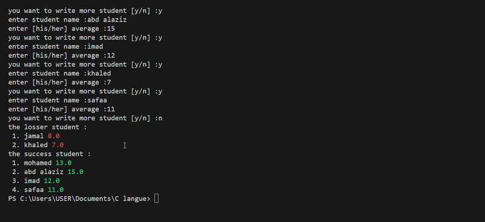

# student-grades-divider
Student Grade divider pass / fail with automatic coloring
# 🎓 Student Grade Divider - Automatic Pass/Fail Splitter



## ✨ Features:
- ✅ **Auto-split**: Pass ✅ | Fail ❌  
- 🎨 **Smart coloring**: Green (>10/20) | Red (<10/20)
- 📊 **Statistics**: Pass/Fail percentages

🛠️ How to Run:
pip install termcolor : to colored the average of each student

🎯 Perfect for:
- Teachers grading exams
- Student performance tracking
- Class statistics
- Custom grading systems

💬 Issues/ideas? Open a discussion!


## 🚀 Quick Usage:

```python
# Simple example
students = [
    {"name": "Ahmed", "grade": 15},
    {"name": "Fatima", "grade": 8}, 
    {"name": "Mohamed", "grade": 12}
]

divide_students(students, max_grade=20, pass_mark=10)


